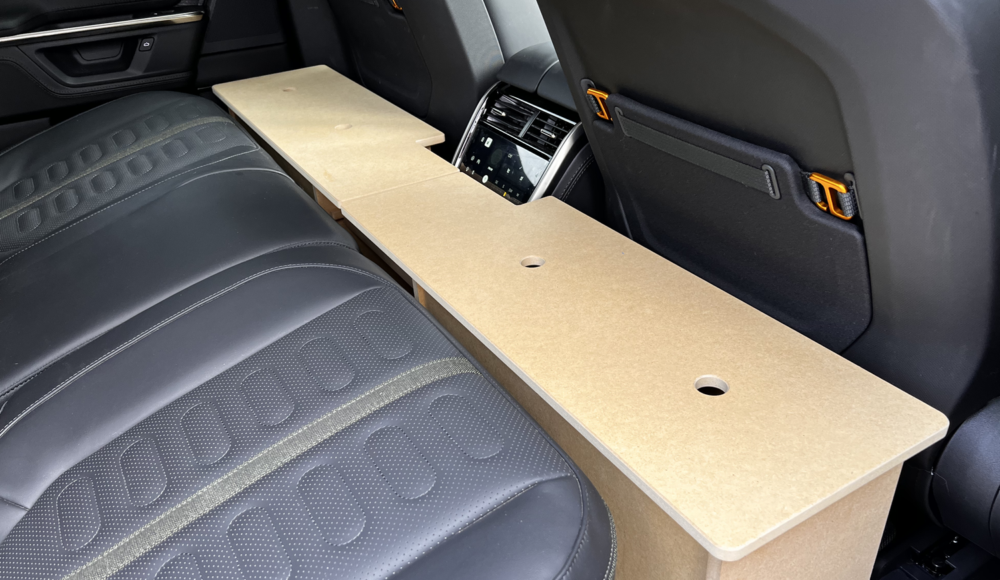
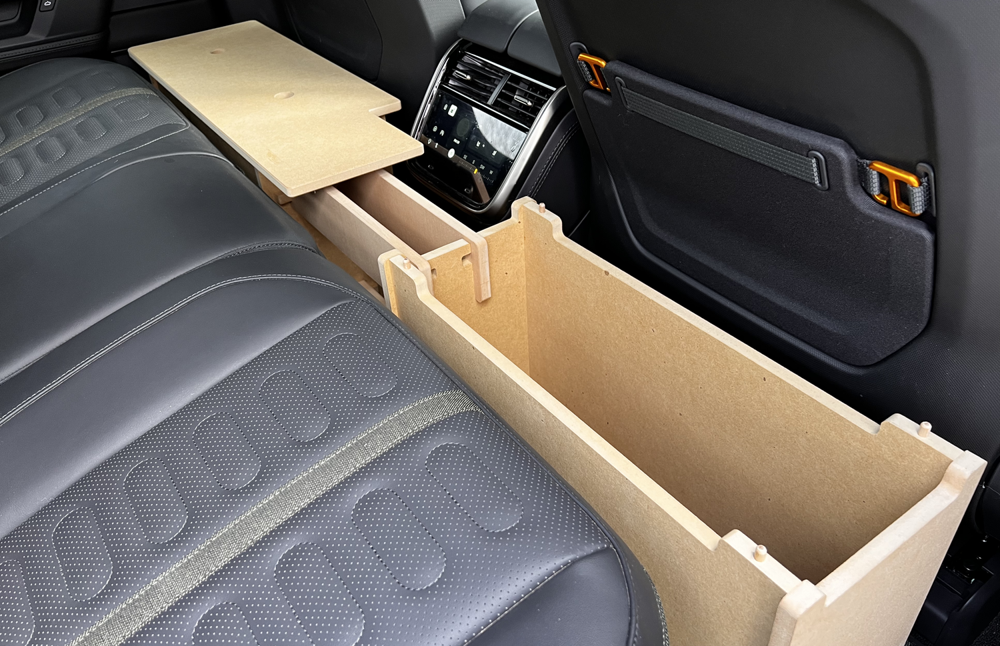
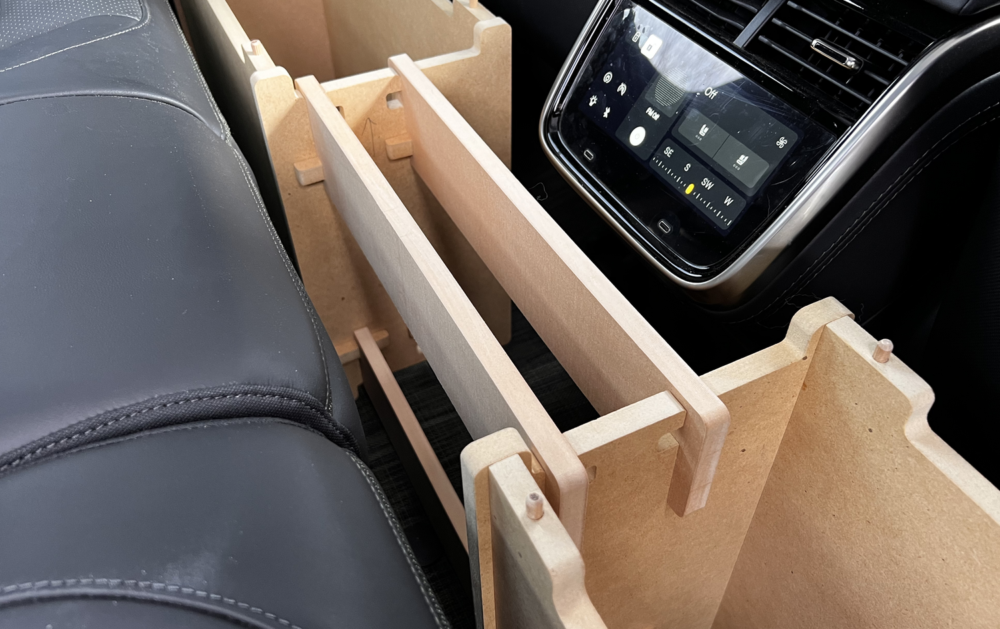
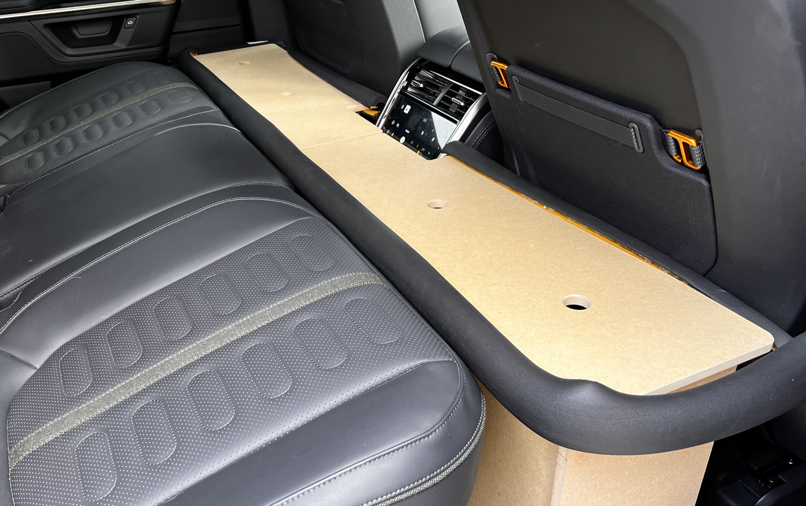

# Rear Footwell Platform

Solid platform approximately level with the rear seats to make a more comfortable area for a large dog.

## Dimensions Between Front and Rear Seats

* 14-3/4" front seat all forward, back of front seat to front of rear seat
* 5" front seat all back, back of front seat to front of rear seat
* 9" driver side example setting, back of front seat to front of rear seat
* 7" center console, back of consle to front of rear seat
* 14" height at front of rear seat
* 53-1/2" edge-to-edge across width of vehicle at outer edge of rear mats
* 21" width of rear seat footwell from outer edge of mat

## Design Dimensions

## Files

* connectors.art = pieces to join the two boxes
* initial_design.skp = [SketchUp](https://www.sketchup.com/en/plans-and-pricing/sketchup-free) initial design file
* long_sides.art = long box sides
* short_sides.art = short box sides
* tops.art = top of box panels that form the platform

.art = [Carveco Maker](https://carveco.com/carveco-software-range/carveco-maker/) CNC design and machining

## V1 Installed

* 1/2" MDF
* 1/2" Pipe Insulation to protect seats

## Changes

* Remove upper inset from sides with slots so the connectors are flush with and support the tops
* Increase slot depths by 1/16" so connectors seat fully
* Add connector pins to CNC file(s)
* Chamfer more edges
* Think about bottoms
